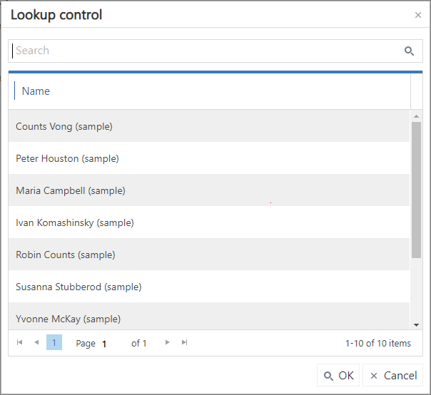
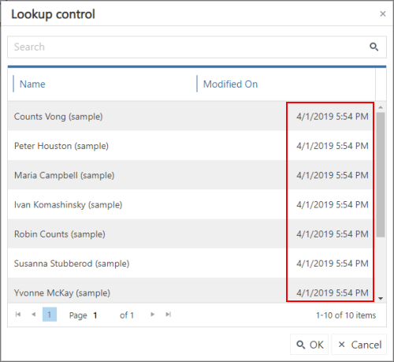
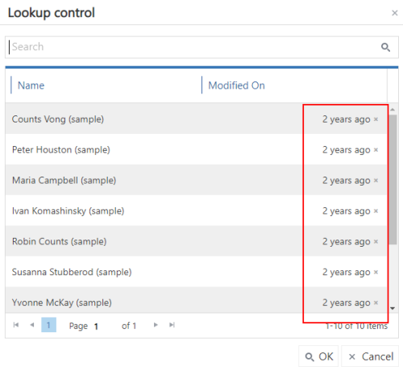

# Lookup

**[Home](/) --> [AgileDialogs design guide](/guides/AgileDialogs-DesignGuide.md) --> Lookup**

---

This control allows looking up records in XRM repository and provides an
auto-complete feature to help user select a value.

Lookup control can populate its items from one of these values:

- XRM: Lookup control populates its items from the results of XRM query.
- JSON: Lookup control populates its items from **AgileXRM** variable which contains a JSON value.
- REST: Lookup control populates its items performing a REST call and getting its elements from the response of REST service.

Lookup control has the *MinLength* property that allows users to set the numberX
of characters typed to fire the auto-complete feature.

When the user clicks the Search icon on the right, the lookup window is opened:

The query used to filter the records presented to the user, is configured by
clicking the `Configure` button. This windows uses the CRM System View -
Quick Find view - to find the data more easily.

To configure the filter criteria, click the Configure button to open the
*Advanced Find* window:

The fields presented in this lookup window are configured in *Columns* tab of
the *Advanced Find* window.

The **AutoNext** property, if set to *true*, enables the control to move
forward, once the user has filled in the control with the desired value.

For instance, if we have a Page Form composed by one Lookup control, with its
*Required* property set to *true* we would need to select an item inside our
control, and press the predefined *Next* button afterwards to keep on
progressing in our process; if we set *AutoNext* to *true*, the process will
continue right after we select a value of our lookup control, without pressing
the *Next* button.

> **Important**: if there is any other control in the current
form with its *required* property set to *true*, the process will not move forward.

The **UseRelativeDataFormat** property determines how Datetime columns are shown.

When its set to *false*, Datetime column are shown using the CRM/CDS date format.

When its set to *true*, Datetime column are shown as friendly relative text and we can get the Datetime value by cross button.

> **Note** When Grid control is configured with UseRelativeDateFormat, we can use the cross button to show the Datetime value

## Related

- [How to configure QueryExpression](../../ref/common/QueryExpression.md)

- [JSON data in AgileDialogs](../common/JSONAgileDialogs.md);

- [How to configure external data](../../ref/common/ExternalData.md)

## Common properties

- [AgileDialogs control common properties](ControlCommonProperties.md)

## Disclaimer of warranty

[Disclaimer of warranty](DisclaimerOfWarranty.md)
