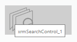
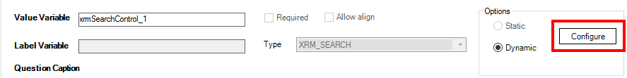
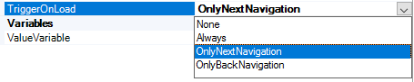
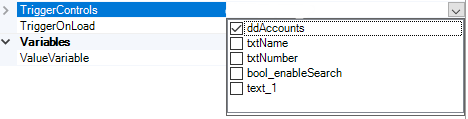
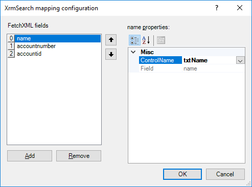
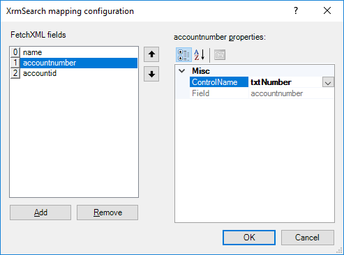
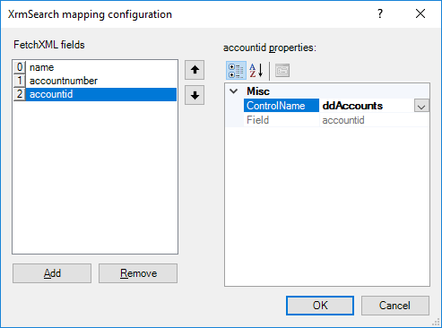

__[Home](/) --> [AgileDialogs design guide](/guides/AgileDialogs-DesignGuide.md) --> XRM  Search Control__

## Search control

Search control allows to perform a XRM FetchXML, JSON and REST search in AgileDialogs page
and set the data retrieved to page controls.

> **Important**: FetchXML query must to retrieve a single record.

Search control can populate its items from one of these values:

-   XRM: Search control populates its items from the results of XRM query.
-   JSON: Search control populates its items from **AgileXRM** variable which contains a JSON value.
-   REST: Search control populates its items performing a REST call and getting its elements from the response of REST service.

Search control does not create variables in process context.

To configure Search control:

-   Click on configure button to build a FetchXML query, as any other data
    control.

    

-   Under Advanced properties tab set these properties:

    -   **TriggerOnLoad**: This property defines if XrmSearch control will
        perform the query when AgileDialogs page is loaded.

        -   **None**: Control will not perform the search when AgileDialogs page is
            loaded.

        -   **OnlyNextNavigation**: Control will perform the query only when user
            does a *Next* navigation (using the *Next* button in AgileDialogs
            page). First page of an AgileDialogs process is considered as *Next*
            navigation.

        -   **OnlyBackNavigation**: Control will perform the query only when user
            does a *Back* navigation(using the *Back* button in AgileDialogs
            page). Navigation using page breadcrumbs is considered as *Back*
            navigation.

        -   **Always**: Control will perform the search in both navigation sources,
            *Next* and *Back* operations.

            

    -   **TriggerControls**. This property defines which controls in the same
        AgileDialogs page will perform the Search control when its value
        changes. Multiple controls will perform multiple query operations.  
        
        

    -   **Mappings**. This property defines how the result data will populate
        the form data. Each column retrieved from FetchXML query needs an
        associated target control to display the retrieved data.

        

        Use the left side column list to define a mapping for all FetchXML
        columns.

        

        

## Related

- [How to configure QueryExpression](../../ref/common/QueryExpression.md)

- [JSON data in AgileDialogs](../common/JSONAgileDialogs.md);

- [How to configure external data](../../ref/common/ExternalData.md)

## Disclaimer of warranty

[Disclaimer of warranty](DisclaimerOfWarranty.md)
