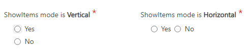

__[Home](/) --> [AgileDialogs design guide](/guides/AgileDialogs-DesignGuide.md) --> YesNo Control__

### YesNo Control

**YesNo** control allows user gets a boolean answer for question by fastest way. 

It is usually used for questions that can be answered with approve / reject.

-   **ShowItemsMode**: Set  how items are rendered within AgileDialogs. Possible values are `Vertical` and `Horizontal`. If this property does not have value items are rendered in vertical way.

## Related

- [Single condition](../../ref/SingleCondition.md)
- [Multiple condition](../../ref/MultipleCondition.md)

## Disclaimer of warranty

[Disclaimer of warranty](DisclaimerOfWarranty.md)

