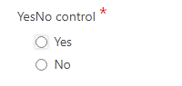

__[Home](/) --> [AgileDialogs design guide](/guides/AgileDialogs-DesignGuide.md) --> YesNo Control__

### YesNo Control

**YesNo** control allows user gets a boolean answer for question by fastest way. It is usually used for questions that can be answered with approve / reject.

