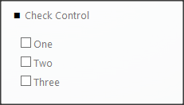

__[Home](/) --> [AgileDialogs Design Guide](/guides/AgileDialogs-DesignGuide.md) --> Check__

# Check control

This control is used to show a set of checkboxes to the user and allows multiple selections.

The values shown to the user can be:

-   Static
-   Dynamic

Also, check control can show *«MultiSelect Option Sets»*  by **FieldAndEntity** property.

Once selected, the internal result set of data to store would be a literal of all the checked values separated by a semicolon (e.g. *One;Two;Three*)
