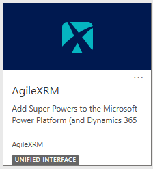
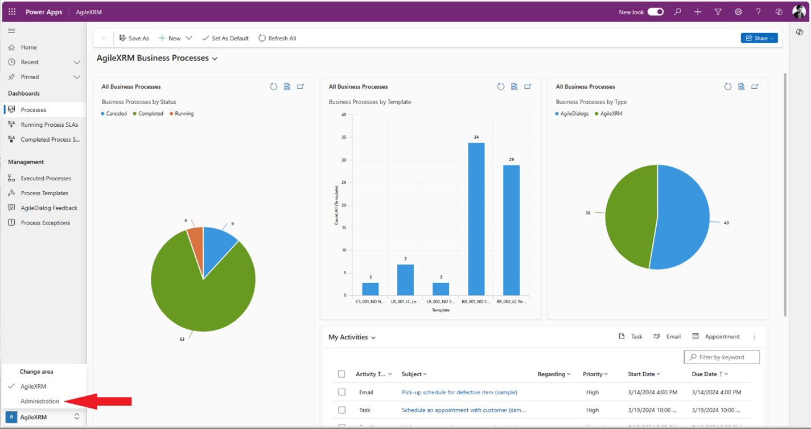
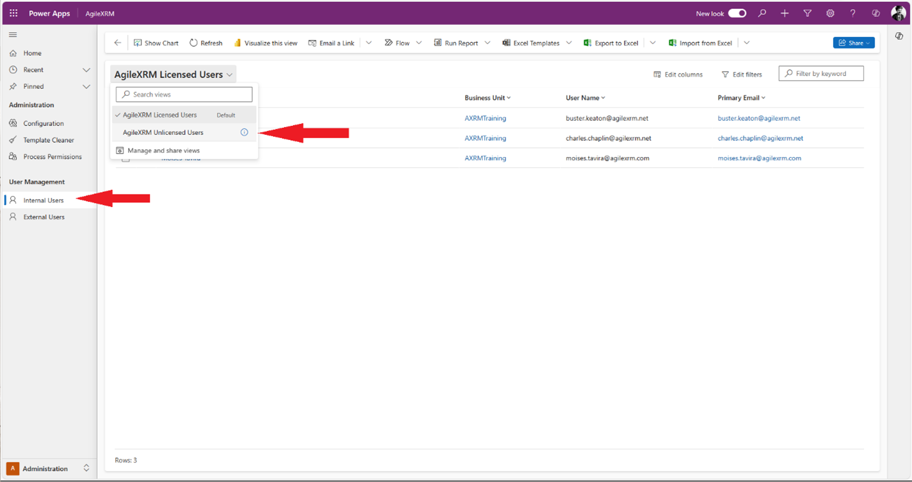
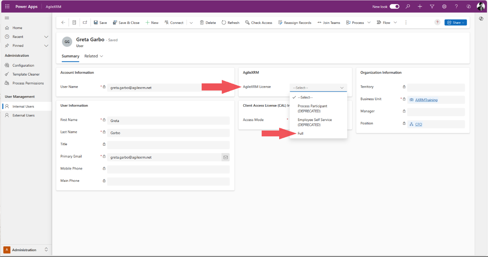

# AgileXRM Assign User Licenses

**[Home](/) -->  AgileXRM Assign User Licenses - Guide**

---

## Overview

Setting the "AgileXRM License" property of the User to "Full" effectively assigns a user license to that user. 

> In Multi-Tenant environments a user can only have a User license in one AgileXRM server.

## Step by step procedure

1.	Open your organization's root page. (i.e. https://\{OrgName\}.crm4.dynamics.com).
2.	Open the "AgileXRM" App.
 
	

3.	Switch to the "Administration" area (bottom left menu).
 
	

4.	Click on "Internal Users" option from the left menu.
5.	Select the view "AgileXRM Unlicensed Users".

	

6.	Select the user you want to assign a license to and click to edit.
7.	In the User form, locate the "AgileXRM" section.
8.	Set the "AgileXRM License" property to "Full".

	
 
9.	Click the "Save" button to apply the changes.

This user has been assigned an AgileXRM user license.
