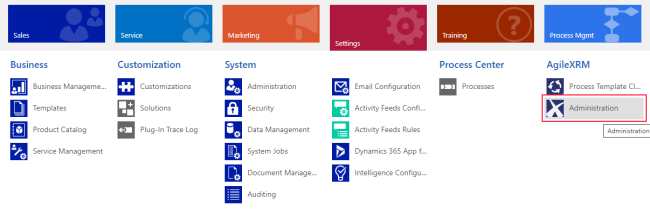
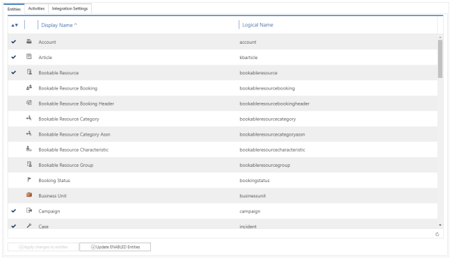
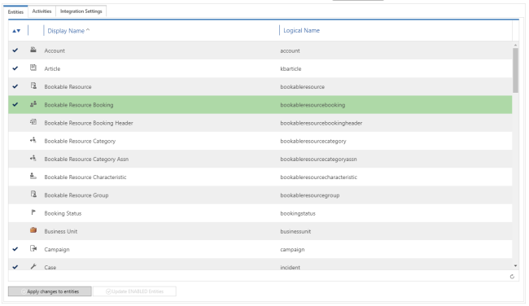
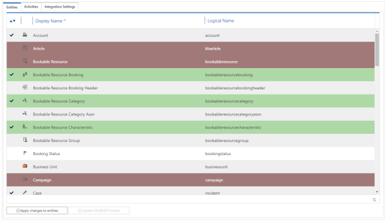
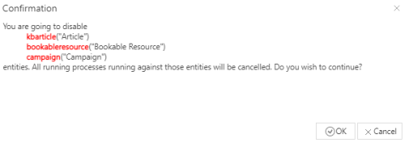
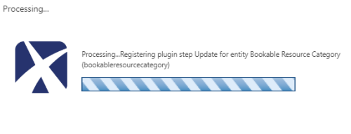
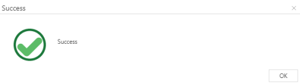

__[Home](/) --> How to enable/disable a CDS entity/ task to execute AgileXRM process__

# How to enable/disable a CDS entity/ task to execute AgileXRM process

Before execute an AgileXRM process againts entity, it needed enable the entity.

Only enabled entities will be available to select as process MAIN ENTITY.

## AgileXRM adminitration tool

Settings and unde AgilrXRM item group, Administration

AgileXRM administration tool is shown. Each entity displays its display and logical names.
Entities which are currently enabled are marked with a check mark at left side. 

## Enable/disable a CDS entity

Choose `Entities`tab, all CDS entities are listed. 

To enable an entity simply click on the row which contains the entity we want enable. Row background color becomes green.

By the same way, to disable an entity click on the row which contains the entity we want disable. Row background color becomes red.

When selection is finished, click `Apply changes to activities` to perform the operation.

Corfirmation message is shown. Click `Ok` button to accept it or `Cancel` to reject.

This operation can takes several minutes, process window is shown and notify process progress

> Depending on the number of selected entities this operation can takes several minutes.The process window is shown and notifying process progress advance.

When process completes success message is shown.

Click `Ok`button to finish.

## Enable/disable a activity task

The way to enable/disable a activity task entity is exactly the same described to enable/disable a CDS entity.

Choose `Activity` tab, choose which activities we want to enable/disable and perform the operation.

## Related

- [AgileXRM Administration tool](../guides/XRMAdministrationTool-UserGuide.md)

## Disclaimer of warranty

[Disclaimer of warranty](../guides/common/DisclaimerOfWarranty.md)