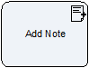

**[Parent](../ref/README.md) --> Add Note**

# Add Note

Use this shape to add a textual note to an entity, which is added to the annotations entity.
For file attachments, please use the Attach/Detah shape.

## Shape-Specific Properties

### EntityId
See [EntityId](common/EntityId.md)

### EntityType
See [EntityType](common/EntityType.md)

### Subject
Sets the title of the Note. It can be a static or a dynamic value.

### Text
Set the text of the body of the Note. It can be a static or a dynamic value.

## Other Common Proporties
All shapes have many other common properties. Look for the here: [Common Poperties](common/CommonProperties.md)

## Actions
See [Actions](common/Actions.md)
