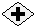

__[Home](/) --> [Reference](/ref) --> And__

# And Shape

An activity that associates multiple activities with the ‘**AND’** condition.
All direct predecessor activities must be completed or cancelled in order for
this shape to complete and allow process to continue.

## Shape-Specific Properties

| Property | Description |
| -------- | ----------- |
| __Dynamic__ | [link](common/Dynamic.md) |

## Other Common Proporties
All shapes have many other common properties. Look them up here: [Common Poperties](common/README.md)

