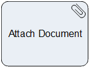

__[Home](/) --> [Reference](/ref) --> Attach Document__

# Attach Document

This activity creates an attachment or attachments (*annotations*) in a CRM entity from other systems.

The source file or files to be attached to CRM entity can be any AgilePoint NX Global Access Token. Global Access Token must be created previously in AgilePoint NX administration portal.

## Shape-Specific Properties

| *Document Destination (CRM Entity)* |  
| -------- | ----------- |
| Property | Description |
| __EntityId__| [Entity Id](common/EntityId.md) |
| __EntityName__| [Entity Name](common/EntityName.md)|
| __ExecuteAsync__ | [Execute Async](common/ExecuteAsync.md) |
| __SaveAnnotationIdTo__| [Save Annotation Id To](common/SaveAnnotationIdTo.md)|
| *__Document Source__* | 
| Property | Description |
| __Source__| [Source](common/Source.md) | 

## Other Common Properties
All shapes have many other common properties. Look them up here: [Common Poperties](common/README.md)

## Actions
See [Actions](common/Actions.md)
