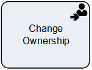

__[Home](/) --> [Reference](/ref) --> Change Ownership__

# Change Ownership

This shape is used to change the Owner of an entity record to another User or
Team.

> __NOTE__: Owner field is a special field and cannot be changed using the *Update
Entity* shape.

## Shape-Specific Properties

| Property | Description |
| -------- | ----------- |
| __EntityId__   | [Entity Id](common/EntityId.md) |
| __EntityName__ | [Entity Name](common/EntityName.md) |
| __ExecuteAsync__ | [Execute Async](common/ExecuteAsync.md) |
| __NewOwner__   | [New Owner](common/NewOwner.md) |
| __OwnerType__  | [Owner Type](common/OwnerType.md) |

## Other Common Properties
All shapes have many other common properties. Look them up here: [Common Poperties](common/README.md)

## Actions
See [Actions](common/Actions.md)
