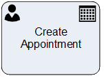

__[Home](/) --> [Reference](/ref) --> Create Appointment__

# Create Appointment

This shape creates an Appointment Activity in CRM.

This shape can optionally have a [Page Form](PageForm.md). This permits
creating activity-based forms, which have all the fields necessary for carrying
out this task by the user.

When the activity is *Marked as Completed*, the process flow continues.

The mapping of the fields is as shown below:

| CRM Field     | AgilePoint setting                                                   |
|---------------|----------------------------------------------------------------------|
| **Required**                | RequiredAttendees property                                           |
| **Optional**                | OptionalAttendees property                                           |
| **Subject**                 | [Subject](common/Subject.md)                                         |
| **Location**                | Location property                                                    |
| **Regarding**               | RegardingEntityId & RegardingEntityType properties                   |
| **Start Time**              | Start On property                                                    |
| **End Time**                | End On property                                                      |
| **ExistingActivityId**      | [Existing Activity Id](common/ExistingActivityId.md)       |
| **All Day Event**           | AllDayEvent property                                                 |
| **Description**             | TaskDescription property                                             |
| **Priority**                | Priority property                                                    |
| **Owner**                   | Participant property . When Participant is a Queue, OwnerID property |
| **Other fields**            | Set using the ActivityProperties property                            |
| **SaveCrmActivityFieldsTo** | [Save CRM Activity Fields To](common/SaveCrmActivityFieldsTo.md)     |

## Participants
The property *ConfigureParticipants* allows to set the Activity owner and (optionally) assign the activity to a queue, just clicking on the ellipsis button.

To see full configuration navigate to the [Participants](./common/Participants.md) detailed section.

## Other Common Properties
All shapes have many other common properties. Look them up here: [Common Properties](common/README.md)

## Actions
See [Actions](common/Actions.md)

## Disclaimer of warranty

[Disclaimer of warranty](../guides/common/DisclaimerOfWarranty.md)