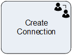
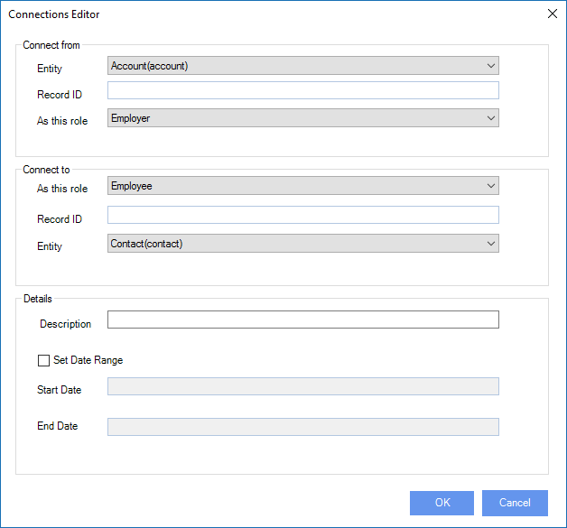

# Create Connection

**[Home](/) --> [Reference](/ref) --> Create Connection**

This shapes is used to create Connections between two entity records

| Field Name / Button        | Definition                                       |
|----------------------------|--------------------------------------------------|
| **Connect from: Entity**       | Entity name of the From side of the connection   |
| **Connect from: Record ID**    | Record ID of the From side of the connection     |
| **Connect from: As this role** | Role of the From side of the connection          |
| **Connect to: As this role**   | Role of the To side of the connection            |
| **Connect to: Record ID**      | Record ID of the To side of the connection       |
| **Connect to: Entity**         | Entity name of the To side of the connection     |
| **Description**                | Text field to add explaination to the connection |
| **Set Date Range**             | If set, enables the Start and End Date fieds     |
| **Start Date**                 | Connection valid from this date                  |
| **End Date**                   | Connection valid until this date                    |

## Shape-Specific Properties

| Property | Description |
| -------- | ----------- |
| **Configuration** | Click the ellipsis button to open the Configuration dialog |

---

## Other Common Properties

All shapes have many other common properties. Look them up here: [Common Poperties](common/README.md)

---

## Actions

See [Actions](common/Actions.md)

## Disclaimer of warranty

[Disclaimer of warranty](../guides/common/DisclaimerOfWarranty.md)
