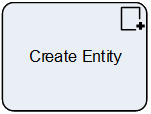

__[Home](/) --> [Reference](/ref) --> Create Entity__

# Create Entity

This activity is used to create an entity record, including custom entities as
well as entities not related to the Main Entity of the process.

## Shape-Specific Properties

| Property | Description |
| -------- | ----------- |
| __Entity Specification__ | [Entity Specification](common/EntitySpecification.md)  |
| __Entity Type__          |[Entity Type](common/EntityType.md)    |
| __ExecuteAsync__         | [Execute Async](common/ExecuteAsync.md) |
| __MainProcessEntity__    | Indicates if the newly created entity becomes the Main Entity or not (i.e. the **CrmBeId** process variable will hold the ID of the newly created record, and **CrmBeType** variable will hold the entity type)<blockquote>**NOTE**: This functionality is for a process that does not have a Main Entity and the record is created as part of the process itself, rather than initiated against an existing record. What it is not designed for, is for changing the Main Entity mid-process. The only supported way of acting upon a different Main Entity is to use Sub-processes that have the desired Main Entity.</blockquote> |
| __OnBehalfOf__           | [On Behalf Of](common/OnBehalfOf.md) |
| __SaveEntityIdTo__       | [Save Entity Id To](common/SaveEntityIdTo.md) |

## Other Common Properties
All shapes have many other common properties. Look them up here: [Common Poperties](common/README.md)

## Actions
See [Actions](common/Actions.md)