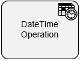

# DateTime Operations

**[Home](/) --> [Reference](/ref) --> DateTime Operations**

---

An activity that lets you specify dates and times, and then uses your rules to makes calculations. This shape can change the operations between two date-time values, or add more time to a given date-time.

Shape configuration is done through the *Configuration* property.

> **NOTE**: This activity is available under  *Miscellaneous Extension.*

## Shape-Specific Properties

| Property | Description |
| -------- | ----------- |
| **Configuration** | Opens the  [DateTime Operations Configuration](common/DateTimeOperationsConfiguration.md) dialog box, where you can configure date calculations. |

---

## Other Common Properties

All shapes have many other common properties. Look them up here: [Common Poperties](common/README.md)

---

## Actions

See [Actions](common/Actions.md)

---

## Disclaimer of warranty

[Disclaimer of warranty](../guides/common/DisclaimerOfWarranty.md)
