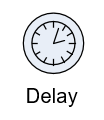

__[Home](/) --> [Reference](/ref) --> Delay__

# Delay

(Description Here)

(More Description on seperate line)

> __NOTE__: Notes in this format.
> More note lines here 

## Shape-Specific Properties

| Property | Description |
| -------- | ----------- |
| __Property 1__ | Description of Property 1 More info in a separate line |
| __Property 2__ | [Link](common/property2.md) |

## Other Common Properties
All shapes have many other common properties. Look them up here: [Common Poperties](common/README.md)

## Actions
See [Actions](common/Actions.md)

