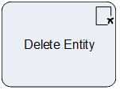

__[Home](/) --> [Reference](/ref) --> Delete Entity__

# Delete Entity

This shape deletes an entity record from CRM.

> **NOTE**: Standard CRM rules and restrictions apply (e.g. Role, Referential
integrity etc).

## Shape-Specific Properties

| Property | Description |
| -------- | ----------- |
| __EntityId__   | [Entity Id](common/EntityId.md) |
| __EntityName__ | [Entity Name](common/EntityName.md)|
| __OnBehalfOf__ | [On Behalf Of](common/OnBehalfOf.md)    |

## Other Common Properties
All shapes have many other common properties. Look them up here: [Common Poperties](common/README.md)

## Actions
See [Actions](common/Actions.md)

## Disclaimer of warranty

[Disclaimer of warranty](../guides/common/DisclaimerOfWarranty.md)