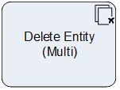

# Delete Entity Multi

**[Home](/) --> [Reference](/ref) --> Delete Entity Multi**

---

This shape deletes multiple entity records from CRM.

The set of records that are affected are selected by either:

* The ones returned by the query configured in the *QueryExpression* property
* From a semicolon-separated list of IDs passed via the *EntityIds* property

> **NOTE**: Standard CRM rules and restrictions apply (e.g. Role, Referential
integrity etc).

---

## Shape-Specific Properties

| Property | Description |
| -------- | ----------- |
| **EntityIds**       | [Entity IDs](common/EntityIds.md) |
| **EntityName**      | [Entity name](common/EntityName.md)|
| **OnBehalfOf**      | [On Behalf Of](common/OnBehalfOf.md)    |
| **QueryExpression** | [QueryExpression](common/QueryExpression.md) |

---

## Other Common Properties

All shapes have many other common properties. Look them up here: [Common Poperties](common/README.md)

---

## Actions

See [Actions](common/Actions.md)

---

## Disclaimer of warranty

[Disclaimer of warranty](../guides/common/DisclaimerOfWarranty.md)
