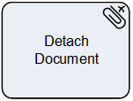

__[Home](/) --> [Reference](/ref) --> Detach Document__

# Detach Document

This shape is used to copy/move attachments (*annotations*) from an CRM entity
to others systems.

The destination system can be any AgilePoint NX Global Access Token. Global
Access Token must be created previously in AgilePoint NX administration portal.

## Shape-Specific Properties

| Property | Description |
| -------- | ----------- |
| **EntityId**    |[EntityId](common/EntityId.md)|
| **EntityName**  |[Entity Name](common/EntityName.md)|
| **Destination** |[Destination](common/DestinationProperty.md)|
| **Filter**      | The filename or filter for the document source. Wildcards are allowed. For example, it can be “\*.pdf” to get all PDF files. |

## Other Common Properties
All shapes have many other common properties. Look them up here: [Common Poperties](common/README.md)

## Actions
See [Actions](common/Actions.md)
