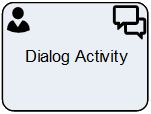

__[Home](/) --> [Reference](/ref) --> Dialog Activity__

# Dialog Activity

This shape is used in AgileXRM processes (not in AgileDialogs models) and can
create any type of CRM Activity with an associated AgileDialog.

> **NOTE**: The chosen Activity Type should have previously been Enabled in
AgileXRM Administration.

When the activity is opened in CRM, the AgileDialog starts for the user to
interact with.

When the AgileDialog is completed this activity is completed and the process
continues.

Use this shape rather than one of the other CRM Activities shapes, when a single Page
Form may not suffice or the user needs to be guided to complete the task.

## Participants
The property *ConfigureParticipants* allows to set the Activity owner and (optionally) assign the activity to a queue, just clicking on the ellipsis button.

To see full configuration navigate to the [Participants](./common/Participants.md) detailed section.

## Shape-Specific Properties

| Property | Description |
| -------- | ----------- |
| **ActivityProperties**            |[Activity Properties](common/ActivityProperties.md)|
| **AfterSubmitAction**             |[After Submit Action](common/AfterSubmitAction.md)|
| **CreateProcessInstanceRecord**   |[Create Process Instance Record](common/CreateProcessInstanceRecord.md)|
| **Dialog**                        |[Dialog](common/SubProcess.md)|
| **EmbededHeight**                 |[Embeded Height](common/EmbededHeight.md)|
| **InParameters**                  |[In Parameters](common/InParameters.md)|
| **OutParamters**                  |[Out Parameters](common/OutParamters.md)|
| **OwnerID**                       |[Owner ID](common/OwnerID.md)|
| **RegardingEntityID**             |[Regarding Entity ID](common/RegardingEntityID.md)|
| **RegardingEntityType**           |[Regarding Entity Type](common/RegardingEntityType.md)|
| **SaveCrmActivityIdTo**           |[Save CRM Activity Id To](common/SaveCrmActivityIdTo.md)|
| **Subject**                       |[Subject](common/Subject.md)|
| **TaskDescription**               |[Task Description](common/TaskDescription.md)|

## Other Common Properties
All shapes have many other common properties. Look them up here: [Common Poperties](common/README.md)

## Actions
See [Actions](common/Actions.md)