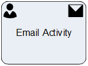

__[Home](/) --> [Reference](/ref) --> Email Activity__

# Email Activity

This shape creates an Email activity in CRM and optionally sends it.

The Email can be sent automatically (if *AutoSend* is set to *True*) or
manually by the user through clicking the *Send* button in CRM. In either case,
once sent, the process continues.

This shape can optionally have a [Page Form](PageForm.md). This permits
creating activity-based forms, which have all the fields necessary for carrying
out this task by the user.

This shape uses **AgilePoint Email Templates** (not CRM Email Templates).

The mapping of the fields is as shown below:

| CRM Field    | AgilePoint setting                                                      |
|--------------|-------------------------------------------------------------------------|
| **From**         | From in Email Template                                                  |
| **To**           | To in Email Template                                                    |
| **CC**           | CC in Email Template                                                    |
| **BCC**          | BCC in Email Template                                                   |
| **Subject**      | Subject in Email Template                                               |
| **Email Body**   | Email Body in Email Template                                            |
| **Regarding**    | RegardingEntityId & RegardingEntityType properties                      |
| **Priority**     | Priority property                                                       |
| **Due Date**     | TimeSpan property                                                       |
| **Owner**        | OwnerID property, and if this is not set, then the Participant property |
| **Other fields** | Set using the ActivityProperties property                               |

Please also see the **[Email Shape Comparison Table](common/EmailShapeComparisonTable.md)** for the use cases for each
of the different email AgileShapes.

## Shape-Specific Properties

| Property | Description |
| -------- | ----------- |
| **ActivityProperties**  | [Activity Properties](common/ActivityProperties.md)|
| **AfterSubmitAction**   | [After Submit Action](common/AfterSubmitAction.md) |
| **AgilePointTemplate**  | [AgilePoint Template](common/AgilePointTemplate.md) |
| **AutoSend**            | Default: False  * **True** The CRM Email will be sent automatically and the Email Activity will be Completed. * **False** - The Email will be created but not send (See also *[AutoComplete](common/AutoComplete.md)*)|
| **EmbededHeight**       | [Embeded Height](common/EmbededHeight.md)|
| **OwnerID**             | [Owner ID](common/OwnerId.md) |
| **PageForm**            | [Page Form](common/PageForm.md) |
| **RegardingEntityID**   | [Regarding Entity ID](common/RegardingEntityID.md) |
| **RegardingEntityType** | [Regarding Entity Type](common/RegardingEntityType.md)| 
| **SaveCrmActivityIdTo** | [Save CRM Activity Id To](common/SaveCrmActivityIdTo.md) |

## Other Common Properties
All shapes have many other common properties. Look them up here: [Common Poperties](common/README.md)

## Actions
See [Actions](common/Actions.md)
