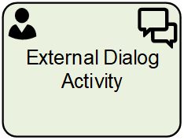

__[Home](/) --> [Reference](/ref) --> External Dialog Activity__

# External Dialog Activity

This shape is used in **AgileXRM** processes (not in AgileDialogs models) and will 
create a custom type of Dynamics365/CDS Activity with an associated AgileDialog.

Created activity can be assigned to a external user of Dynamics365/CDS platform.

The associated AgileDialog URL can be send to the user by email to allow the 
interaction with.

When the AgileDialog is completed this activity is completed and the process
continues.

Use this shape rather than one of the other CRM Activities shapes, when a single Page
Form may not suffice or the user needs to be guided to complete the task.

## Participants
The property *ConfigureParticipants* allows to set the Activity owner and (optionally) assign the activity to a queue, just clicking on the ellipsis button.

To see full configuration navigate to the [Participants](./common/Participants.md) detailed section.

## Shape-Specific Properties

| Property | Description |
| -------- | ----------- |
| **CreateProcessInstanceRecord**   |[Create Process Instance Record](common/CreateProcessInstanceRecord.md)|
| **Dialog**                        |[Dialog](common/SubProcess.md)|
| **ExternalUserLogin**             |[External User Login](common/ExternalUserLogin.md)|
| **InParameters**                  |[In Parameters](common/InParameters.md)|
| **OutParamters**                  |[Out Parameters](common/OutParamters.md)|

## Other Common Properties
All shapes have many other common properties. Look them up here: [Common Poperties](common/README.md)

## Actions
See [Actions](common/Actions.md)

## Disclaimer of warranty

[Disclaimer of warranty](../guides/common/DisclaimerOfWarranty.md)