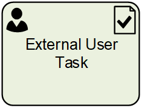

__[Home](/) --> [Reference](/ref) --> External User Task__

# External User Task

This shapes creates a task for an External User (a user which is not in the organization).
These users are Dynamics 365/CDS Contacts and have a corresponding Username and Password stored in custom AgileXRM fields.
These users are identified in AgileXRM as a single user called AgileXRM\ExternalUser.
The task will be presented to the user outside the D365/CDS UI, for example, in a Dynamics 365 Portal, SharePoint or any other portal technology, where the user can interact with it.

## Participants
The property *ConfigureParticipants* allows to set the Activity owner and (optionally) assign the activity to a queue, just clicking on the ellipsis button.

To see full configuration navigate to the [Participants](./common/Participants.md) detailed section.

## Shape-Specific Properties

| Property | Description |
| -------- | ----------- |
| **ExternalUserLogin**  |[External User Login](common/ExternalUserLogin.md)|
| **PageForm**           | [Page Form](common/PageForm.md)            |

## Other Common Properties
All shapes have many other common properties. Look them up here: [Common Poperties](common/README.md)

## Actions
See [Actions](common/Actions.md)