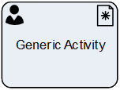

__[Home](/) --> [Reference](/ref) --> Generic Activity__

# Generic Activity

This shape can create any type of activity in CRM, and is particulary suited for
use with custom activity types.

> **NOTE**: The chosen Activity Type should have previously been Enabled in
AgileXRM Administration.

When the activity is *Marked as Completed*, the process flow continues.

This shape can optionally have a [Page Form](PageForm.md). This permits
creating activity-based forms, which have all the fields necessary for carrying
out this task by the user.

Apart from the Subject (subject) and TaskDescription (description) fields, the
other fields in the activity, including any custom fields, can be updated using
the *ActivityProperties* property.

## Participants
The property *ConfigureParticipants* allows to set the Activity owner and (optionally) assign the activity to a queue, just clicking on the ellipsis button.

To see full configuration navigate to the [Participants](./common/Participants.md) detailed section.

## Shape-Specific Properties

| Property | Description |
| -------- | ----------- |
| **ActivityProperties**      |[Activity Properties](common/ActivityProperties.md)|
| **AfterSubmitAction**       |[After Submit Action](common/AfterSubmitAction.md)|
| **EmbededHeight**           |[Embeded Height](common/EmbededHeight.md)|
| **ExistingActivityId**      | [Existing Activity Id](common/ExistingActivityId.md)       |
| **OwnerID**                 |[DEPRECATED][Owner ID](common/OwnerID.md)|
| **PageForm**                |[Page Form](common/PageForm.md)|
| **RegardingEntityID**       |[Regarding Entity ID](common/RegardingEntityID.md)|
| **RegardingEntityType**     |[Regarding Entity Type](common/RegardingEntityType.md)|
| **SaveCrmActivityIdTo**     |[DEPRECATED][Save CRM Activity Id To](common/SaveCrmActivityIdTo.md)|
| **SaveCrmActivityFieldsTo** | [Save CRM Activity Fields To](common/SaveCrmActivityFieldsTo.md)     |
| **Subject**                 |[Subject](common/Subject.md)|
| **TaskDescription**         |[Task Description](common/TaskDescription.md)|

## Other Common Properties
All shapes have many other common properties. Look them up here: [Common Poperties](common/README.md)

## Actions
See [Actions](common/Actions.md)

## Disclaimer of warranty

[Disclaimer of warranty](../guides/common/DisclaimerOfWarranty.md)