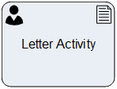

__[Home](/) --> [Reference](/ref) --> Letter Activity__

# Letter Activity

This shape creates a Letter Activity in CRM.

This shape can optionally have a [Page Form](PageForm.md). This permits
creating activity-based forms, which have all the fields necessary for carrying
out this task by the user.

When the activity is *Marked as Completed*, the process flow continues.

The mapping of the fields is as shown below:

| CRM Field    | AgilePoint setting                                                       |
|--------------|--------------------------------------------------------------------------|
| **From**         | Sender property                                                          |
| **To**           | Recipient property                                                       |
| **Address**      | Destination property                                                     |
| **Direction**    | CommunicationDirection property                                          |
| **Subject**      | Subject property                                                         |
| **Description**  | TaskDescription property                                                 |
| **Regarding**    | RegardingEntityId & RegardingEntityType properties                       |
| **Priority**     | Priority property                                                        |
| **Due**          | TimeSpan property                                                        |
| **Owner**        | the Participant property . When Participant is a Queue, OwnerID property |
| **Other fields** | Set using the ActivityProperties property                                |

## Shape-Specific Properties

| Property | Description |
| -------- | ----------- |
| **ActivityProperties**     |[Activity Properties](common/ActivityProperties.md)|
| **AfterSubmitAction**      |[After Submit Action](common/AfterSubmitAction.md)|
| **CommunicationDirection** |[Communication Direction](common/CommunicationDirection.md)|
| **Destination**            |This is the Address  of the Recipient. It could be a static or dynamic value.|
| **EmbededHeight**          |[Embeded Height](common/EmbededHeight.md)|
| **OwnerID**                |[Owner ID](common/OwnerID.md)|
| **PageForm**               |[Page Form](common/PageForm.md)|
| **Recipient**              |[Recipient](common/Recipient.md)|
| **RegardingEntityID**      |[Regarding Entity ID](common/RegardingEntityID.md)|
| **RegardingEntityType**    |[Regarding Entity Type](common/RegardingEntityType.md)|
| **SaveCrmActivityIdTo**    |[Save CRM Activity Id To](common/SaveCrmActivityIdTo.md)|
| **Sender**                 |[Sender](common/Sender.md)|
| **Subject**                |[Subject](common/Subject.md)|
| **TaskDescription**        |[Task Description](common/TaskDescription.md)|

## Other Common Properties
All shapes have many other common properties. Look them up here: [Common Poperties](common/README.md)

## Actions
See [Actions](common/Actions.md)
