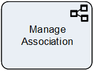
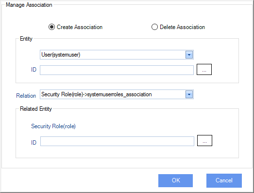

__[Home](/) --> [Reference](/ref) --> Manage Association__

# Manage Association

This shape is used to manage a M:M relationship, for example to add a Security Role to a
User or remove it.

## Configuration Dialog

| Field Name / Button       | Definition                                                                                                                               |
|---------------------------|------------------------------------------------------------------------------------------------------------------------------------------|
| **Create/Delete Association** | Choose this option to create / delete the association relationship.                                                                      |
| **Entity**                    | Select the entity type from one side of the M:M relationship                                                                             |
| **Entity ID**                 | Enter the Entity ID for the above entity type. This can be a dynamic value. Click the ellipsis button to open the Schema Selector dialog |
| **Relation**                  | Select the entity type for the other side of the M:M relationship                                                                        |
| **Related Entity ID**         | Enter the ID for the related entity type. This can be a dynamic value. Click the ellipsis button to open the Schema Selector dialog |

## Shape-Specific Properties

| Property | Description |
| -------- | ----------- |
| **Configuration** | Click the ellipsis button to open the Configuration window |
| __ExecuteAsync__ | [Execute Async](common/ExecuteAsync.md) |

## Other Common Properties
All shapes have many other common properties. Look them up here: [Common Poperties](common/README.md)

## Actions
See [Actions](common/Actions.md)

