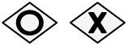
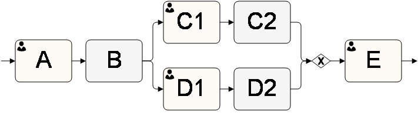
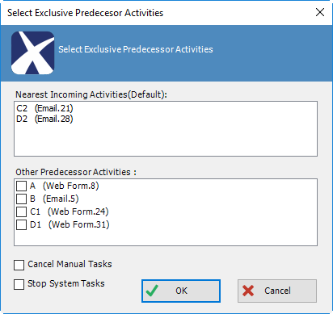

__[Home](/) --> [Reference](/ref) --> OR__

# OR

An activity that associates multiple activities with the *OR* condition
(non-exclusive / exclusive). Successful completion of one or more of the
associated activities will trigger the exit of this AgileShape.

In the *Exclusive* mode, this shape is useful for cancelling a route in a parallel
flow situation.

## Configuration Dialog

Configuration dialog is only available when the *Exclusive* property is set to
*True*.

## Exclusive OR

Consider this example process extract:

The dialog would show the following:

| Field Name / Button          | Definition                                                                                                                                                                                                                                     |
|------------------------------|------------------------------------------------------------------------------------------------------------------------------------------------------------------------------------------------------------------------------------------------|
| **Nearest Incoming Activities**  | ReadOnly Automatically lists all direct predecessors here. When the OR AgileShape is entered via one of these, the other one is automatically Cancelled if it was active at the time.                                                         |
| **Other Predecessor Activities** | Here it is possible to select any other predecessors to be Cancelled when OR AgileShape is entered. It is necessary to also select the corresponding *Cancel Manual Tasks* and/or *Stop System Tasks* to enable cancellation of the selection. |
| **Cancel Manual Tasks**          | When selected, any manual activities selected in the *Other Predecessor Activities* listbox are cancelled when process enters the OR AgileShape.                                                                                               |
| **Stop System Tasks**            | When selected, any automatic activities selected in the *Other Predecessor Activities* listbox are cancelled when process enters the OR AgileShape.                                                                                            |

> **NOTE**: If none of the checkboxes are selected, this shape behaves as if the
> *Exclusive* property was set to *False*. If only *Cancel Manual Tasks* is
> checked, the manual tasks will be cancelled (nearest incoming and other
> predecessor activities), and in case of *Stop System Tasks*, both the nearest
> incoming activities and other predecessor that fit the category will be stopped.

## Shape-Specific Properties

| Property | Description |
| -------- | ----------- |
| **Configuration** | <blockquote>**NOTE:** Configuration is only available when *Exclusive* property is set to *True*</blockquote>Opens the *Select Exclusive Predecessor Activities* dialog box, to configure whether the activities in the parallel process flow will continue to process or be cancelled once one of the process flows enters this AgileShape |
| **Exclusive**     | [Exclusive](common/Exclusive.md)|

## Other Common Properties
All shapes have many other common properties. Look them up here: [Common Poperties](common/README.md)

