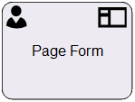

__[Home](/) --> [Reference](/ref) --> Page Form__

# Page Form

This shape is used in AgileDialogs models only and is for designing a Page (a
group of controls) in an AgileDialog.

For a detailed explanation of how to use this and other AgileDialog shapes,
please see **[AgileDialogs Design Guide](../guides/AgileDialogs-DesignGuide.md)**.

## Shape-Specific Properties

| Property | Description |
| -------- | ----------- |
| **FormConfiguration** | Click the ellipsis to open the [Form Configuration dialog](../guides/common/PageFormShape.md).|

## Other Common Properties
All shapes have many other common properties. Look them up here: [Common Poperties](common/README.md)

## Actions
See [Actions](common/Actions.md)
