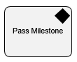

__[Home](/) --> [Reference](/ref) --> Pass Milestone__

# Pass Milestone

An activity that, when used together with the [Wait For Milestone activity](WaitForMilestone.md), lets a process wait for an event that is not in the process, and then continue once the event is complete. 

For example, if an activity can not start until an approval occurs in a subprocess, you can use this activity to control the process based on that event..

> __NOTE__: This activity is available under  *Advanced Extension*.

## Other Common Properties
All shapes have many other common properties. Look them up here: [Common Poperties](common/README.md)

## Actions
See [Actions](common/Actions.md)
