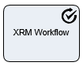

__[Home](/) --> [Reference](/ref) --> Run XRM Workflow__

# Run XRM Workflow

This automatic activity kicks off a CRM Workflow. This permits reutilizing any
existing CRM Workflows. Please note that by definition, CRM Workflows are
asynchronous, so this shape will not wait for the execution of the Workflow to
complete before becoming completed itself.

## Shape-Specific Properties

| Property | Description |
| -------- | ----------- |
| **EntityId**   |[Entity ID](common/EntityId.md)|
| **EntityName** |[Entity Name](common/EntityName.md)|
| **Workflow**   | This is the name of the CRM Workflow for the selected *Entity Name* property. This can be a dynamic value using process context variables (“**\$\{variablename\}”**) |

## Other Common Properties
All shapes have many other common properties. Look them up here: [Common Poperties](common/README.md)

## Actions
See [Actions](common/Actions.md)
