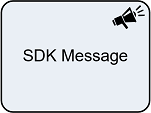

__[Home](/) --> [Reference](/ref) --> SDK Message__

# SDK Message

This shape can:

-   Execute a specific set of Dynamics 365 SDK Messages.
-   Set returned values to custom attribute(s)

## Shape-Specific Properties

| Property | Description |
| -------- | ----------- |
| **InputParameters**           | [SDK Parameters Configuration](common/SDKParametersConfiguration.md) Input parameters for selected message|
| **MessageName**  | Combobox selector with available SDK Messages: AddUserToRecordTeam, RemoveUserFromRecordTeam, WhoAmI, ReassignObjectsOwner, ReassignObjectsSystemUser, CalculateRollupField, RetrieveExchangeRate, AddPrincipalToQueue, AddToQueue, PickFromQueue, ReleaseToQueue, RemoveFromQueue, ConvertOwnerTeamToAccessTeam
| **OutputParameters**      | [SDK Parameters Configuration](common/SDKParametersConfiguration.md) Ouput parameters for selected message|

## Other Common Properties
All shapes have many other common properties. Look them up here: [Common Poperties](common/README.md)

## Actions
See [Actions](common/Actions.md)

## Disclaimer of warranty

[Disclaimer of warranty](../guides/common/DisclaimerOfWarranty.md)