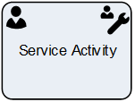

**[Home](/) --> [Reference](/ref) --> Service Activity**

# Service Activity

This shape creates a Service Activity in CRM.

This shape can optionally have a [Page Form](PageForm.md). This permits
creating activity-based forms, which have all the fields necessary for carrying
out this task by the user.

When the activity is *Marked as Completed*, the process flow continues.

The mapping of the fields is as shown below:

| CRM Field    | AgilePoint setting                                                   |
|--------------|----------------------------------------------------------------------|
| **Subject**      | Subject property                                                     |
| **Service**      | RequiredAttendees property                                           |
| **Regarding**    | RegardingEntityId & RegardingEntityType properties                   |
| **Priority**     | Priority property                                                    |
| **Owner**        | Participant property. When Participant is a Queue, OwnerID property  |
| **Description**  | TaskDescription property                                             |
| **Other fields** | Set using the ActivityProperties property                            |

 ## Participants
The property *ConfigureParticipants* allows to set the Activity owner and (optionally) assign the activity to a queue, just clicking on the ellipsis button.

To see full configuration navigate to the [Participants](./common/Participants.md) detailed section.

## Shape-Specific Properties

| Property | Description |
| -------- | ----------- |
| **ActivityProperties**      | [Activity Properties](common/ActivityProperties.md)  |
| **AfterSubmitAction**       | [After Submit Action](common/AfterSubmitAction.md)   |
| **EmbededHeight**           | [Embeded Height](common/EmbededHeight.md)       |
| **ExistingActivityId**      | [Existing Activity Id](common/ExistingActivityId.md)       |
| **OwnerID**                 | [DEPRECATED][Owner ID](common/OwnerID.md)             |
| **PageForm**                | [Page Form](common/PageForm.md)            |
| **RegardingEntityID**       | [Regarding Entity ID](common/RegardingEntityID.md)   |
| **RegardingEntityType**     | [Regarding Entity Type](common/RegardingEntityType.md) |
| **SaveCrmActivityIdTo**     | [DEPRECATED] [Save CRM Activity Id To](common/SaveCrmActivityIdTo.md) |
| **SaveCrmActivityFieldsTo** | [Save CRM Activity Fields To](common/SaveCrmActivityFieldsTo.md)     |
| **Service**                 | This sets the Service associated with this activity. It should be the ID of a Service entity.             |
| **Subject**                 | [Subject](common/Subject.md)             |
| **TaskDescription**         | [Task Description](common/TaskDescription.md)     |

## Other Common Properties
All shapes have many other common properties. Look them up here: [Common Poperties](common/README.md)

## Actions
See [Actions](common/Actions.md)

## Disclaimer of warranty

[Disclaimer of warranty](../guides/common/DisclaimerOfWarranty.md)