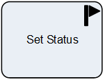

__[Home](/) --> [Reference](/ref) --> Set Status__

# Set Status

This shape is used to change the *Status* & *Status Reason* of a record in CRM.

> **NOTE**: Status fields are special fields and cannot be changed using the
*Update Entity* shape.

## Shape-Specific Properties

| Property | Description |
| -------- | ----------- |
| **ClosePendingTasks**    |[Close Pending Tasks](common/ClosePendingTasks.md)  |
| **Closing Task Subject** |[Closing Task Subject](common/ClosingTaskSubject.md) |
| **EntityId**             |[Entity Id](common/EntityId.md) |
| **EntityName**           |[Entity Name](common/EntityName.md) |
| **Status**               |[Status](common/status.md)  |
| **StatusStateValue**     |[Status State Value](common/StatusStateValue.md)  |

## Other Common Properties
All shapes have many other common properties. Look them up here: [Common Poperties](common/README.md)

## Actions
See [Actions](common/Actions.md)
