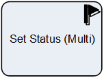

__[Home](/) --> [Reference](/ref) --> Set Status Multi__

# Set Status Multi

This shape is used to change the *Status* & *Status Reason* of multiple entity
records in CRM.

The set of records that are affected are selected by either:

-   The ones returned by the query configured in the *QueryExpression* property
-   From a semicolon-separated list of IDs passed via the *EntityIds* property

> **NOTE**: Status fields are special fields and cannot be changed using the *Update Entity (Multi)* shape.

## Shape-Specific Properties

| Property | Description |
| -------- | ----------- |
| **ClosePendingTasks**    |[Close Pending Tasks](common/ClosePendingTasks.md)  |
| **Closing Task Subject** |[Closing Task Subject](common/ClosingTaskSubject.md) |
| **EntityIds**            |[Entity Ids](common/EntityIds.md)|
| **EntityName**           |[Entity Name](common/EntityName.md)|
| **QueryExpression**      |[Query Expression](common/QueryExpression.md)|
| **Status**               |[Status](common/Status.md)  |
| **StatusStateValue**     |[Status State Value](common/StatusStateValue.md)  |

## Other Common Properties
All shapes have many other common properties. Look them up here: [Common Poperties](common/README.md)

## Actions
See [Actions](common/Actions.md)