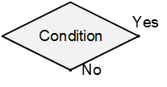
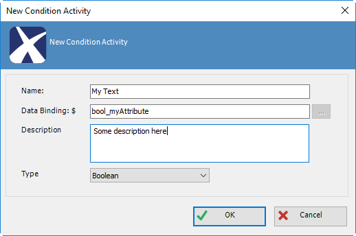
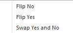

__[Home](/) --> [Reference](/ref) --> Single Condition__

# Single Condition

This is a conditional logic activity that branches into one of two routes
determined by a Boolean value. For instance, test the Approval status of an
Expense Report.

## Configuration Dialog

The following dialog is shown when this shape is dropped on the canvas:

| Field Name / Button | Definition                                                                                       |
|---------------------|--------------------------------------------------------------------------------------------------|
| **Name**                | See (Name) property                                                                              |
| **Data Binding**        | See Property Binding property                                                                    |
| **Ellipsis (...)**      | Opens the dialog for selecting a process variable or context variable See Schema Selector Dialog |
| **Description**         | See Description property                                                                         |
| **Type**                | Is always Boolean                                                                                |

## Shape-Specific Properties

| Property | Description |
| -------- | ----------- |
| **Property Binding**| Click its ellipsis button to open the configuration dialog. The data binding expression that is used to evaluate the value of the condition at runtime. It shows the content of the Data Binding field in the Configuration Dialog, which would be a Dynamic Value (Process variable or Context data) that should evaluate to a Boolean (true, false, TRUE, FALSE, True, False, 0 or 1).<blockquote>**NOTE**: If the value is NULL (i.e. has no value) then it is treated as FALSE<blockquote/> |

## Other Common Properties
All shapes have many other common properties. Look them up here: [Common Poperties](common/README.md)

## Actions

By clicking the right mouse button on the shape, these actions are shown in the
context menu. These allow repositioning the Yes and No connections of the shape
for better readability of the process model.

## Disclaimer of warranty

[Disclaimer of warranty](../guides/common/DisclaimerOfWarranty.md)
