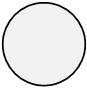

**[Home](/) --> [Reference](/ref) --> Start**

# Start

This is a special AgileShape that represents the starting point of a process.
This AgileShape is activated when a process instance is initiated, and can never
be reentered. A process template must always contain exactly one Start
AgileShape.

## Other Common Properties
All shapes have many other common properties. Look them up here: [Common Poperties](common/README.md)

## Disclaimer of warranty

[Disclaimer of warranty](../guides/common/DisclaimerOfWarranty.md)