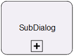

**[Home](/) --> [Reference](/ref) --> SubDialog**

# SubDialog

This shape is used in AgileDialogs models only and is for initiating a SubDialog
from another.

For a detailed explanation of how to use this and other AgileDialog shapes,
please see **[AgileDialogs Design Guide](../guides/AgileDialogs-DesignGuide.md)**.

## Shape-Specific Properties

| Property | Description |
| -------- | ----------- |
| **NamePrefix** | [Name Prefix](common/NamePrefix.md)  |
| **SubDialog**  | [Sub Dialog](common/SubProcess.md) |

## Other Common Properties
All shapes have many other common properties. Look them up here: [Common Poperties](common/README.md)

## Actions
See [Actions](common/Actions.md)

## Disclaimer of warranty

[Disclaimer of warranty](../guides/common/DisclaimerOfWarranty.md)
