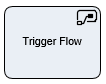

__[Home](/) --> [Reference](/ref) --> Trigger Flow__

# Trigger Flow

This shape is used to start an automated flow thats already exists in yours Microsoft environment.

If the *Wait* parameter is set to *True*, the process continues once the flow that were initiated by this shape is completed.

## Shape-Specific Properties

| Property | Description |
| -------- | ----------- |
| **FLOW** | The name of automated Flow to start |

## Other Common Properties
All shapes have many other common properties. Look them up here: [Common Poperties](common/README.md)

## Actions
See [Actions](common/Actions.md)
