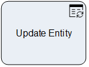

__[Home](/) --> [Reference](/ref) --> Update Entity__

# Update Entity

This activity is used to update an entity record, including custom entities
as well as entities not related to the Main Entity.

## Shape-Specific Properties

| Property | Description |
| -------- | ----------- |
| __EntityID__ | [Entity Id](common/EntityId.md)  |
| __EntitySpecification__ | [Entity Specification](common/EntitySpecification.md)  |
| __EntityType__   |[Entity Type](common/EntityType.md)    |
| __OnBehalfOf__   |[On Behalf Of](common/OnBehalfOf.md)    |

## Other Common Properties
All shapes have many other common properties. Look them up here: [Common Poperties](common/README.md)

## Actions
See [Actions](common/Actions.md)

## Disclaimer of warranty

[Disclaimer of warranty](../guides/common/DisclaimerOfWarranty.md)