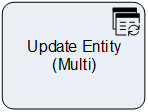

**[Home](/) --> [Reference](/ref) --> Update Entity Multi**

# Update Entity Multi

This activity is used to update multiple entity records of the same type (usually child entity records) at the same time,
including custom entities as well as entities not related to the Main Entity.

The set of records that are affected are selected by either:

-   The ones returned by the query configured in the *QueryExpression* property
-   From a semicolon-separated list of IDs passed via the *EntityIds* property

## Shape-Specific Properties

| Property | Description |
| -------- | ----------- |
| **EntityIDs** | [Entity IDs](common/EntityIds.md)  |
| **EntitySpecification** | [Entity Specification](common/EntitySpecification.md)  |
| **EntityType**   |[Entity Type](common/EntityType.md)    |
| **OnBehalfOf**   |[On Behalf Of](common/OnBehalfOf.md)    |

## Other Common Properties
All shapes have many other common properties. Look them up here: [Common Poperties](common/README.md)

## Actions
See [Actions](common/Actions.md)

## Disclaimer of warranty

[Disclaimer of warranty](../guides/common/DisclaimerOfWarranty.md)