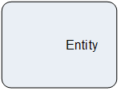

__[Home](/) --> [Reference](/ref) --> Upsert Entity__

# Upsert Entity

This activity is used to look for a particular entity record (or set of records) to be updated if there are found, otherwise a new record is created, including custom entities
as well as entities not related to the Main Entity.

The set of records that are affected are selected by the ones returned by the query configured in the *QueryExpression* property

## Shape-Specific Properties

| Property | Description |
| -------- | ----------- |
| __EntitySpecification__ 				| [Entity Specification](common/EntitySpecification.md)  |
| __EntityType__   						|[Entity Type](common/EntityType.md)    |
| __ExecuteAsync__ 						| [Execute Async](common/ExecuteAsync.md) |
| __OnBehalfOf__   						|[On Behalf Of](common/OnBehalfOf.md)    |
| **QueryExpression** 					| [QueryExpression](common/QueryExpression.md) |
| **RecordCreatedValueTo** 				| [Record Created Value To](common/RecordCreatedValueTo.md) |
| __SaveEntityIdTo__       				| [Save Entity Id To](common/SaveEntityIdTo.md) |
| __ThrowExceptionIfMultipleFound__ 	| [Throw Exception If Multiple Found](common/ThrowExceptionIfMultipleFound.md) |

## Other Common Properties
All shapes have many other common properties. Look them up here: [Common Poperties](common/README.md)

## Actions
See [Actions](common/Actions.md)

