__[Home](/) --> [Reference](/ref) --> WCF Service Activity__

# WCF Service Activity

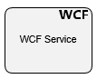

This shape creates a WCF Service Activity, which allows consuming a WCF Web
Service to retrieve extrernal data or send data externally.

## WCF Service Schema Mapper

### Request Mappings Info

Once we have linked our WCF Service Configuration against a selected WCF
Service, we are in position to configure the mappings for the *request* and
*response* sections. A practical example will be shown in order to demonstrate
the capabilities of the shape fully, and the schema mapper functionalities in
detail.

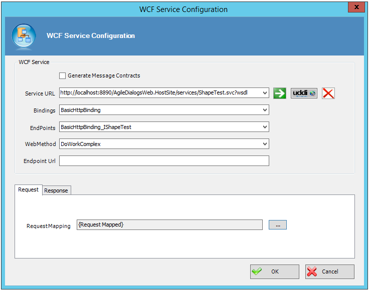

Figure A. Image of a configuration against a selected WCF Service

As it can be seen, the WCF method *DoWorkComplex* is selected, so we are ready
to map the input parameters to the service (meaning, if the WCF Service requires
any input parameter, it will be here where we will pass the parameter to the
service). Steps to follow:

Click on the ellipsis button inside the *Request Section*

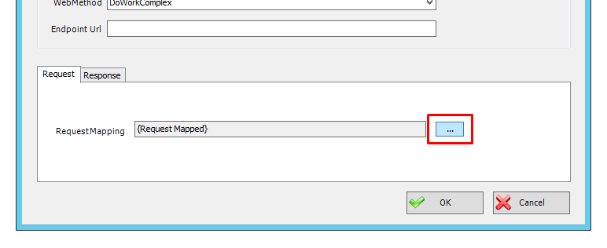

Once the *Request* mappings window is opened, the visual interface is divided
in various sections, explained in depth next:

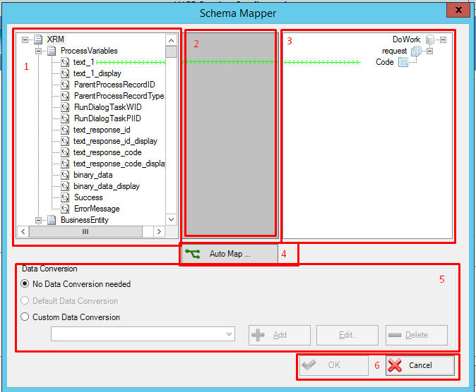

1. **Input parameters** Data taken from the process context that can be sent
as a parameter to the desired service, if needed.

Different types of data can be passed to the service:

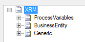

\- ProcessVariables: Context-related variables from the process template that
hosts this WCF shape.

\- BusinessEntity: Data belonging to the CRM entity associated to the process.

\- Generic: XRM generic variables.

2. **Mappings** In this area, the mappings between the variables to pass and
the WCF (if such service has defined any) are defined. To add mappings, follow
these steps:

-   Given a Process Variable value called *text_1* which we want to pass as a
    parameter to a WCF Method: position the mouse over the XRM parameter,
    left-click over the variable, and keeping the mouse pressed, drag the mouse
    cursor over the destination input variable belonging to the service (in this
    case, code).

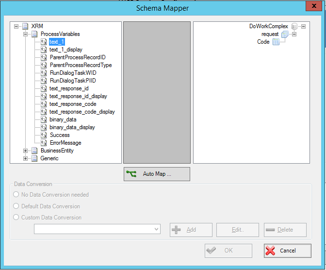

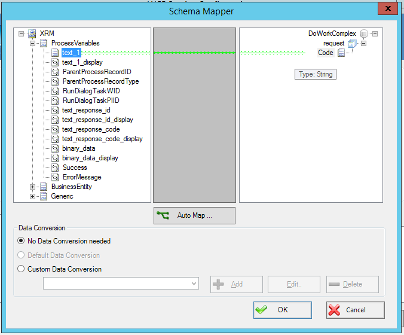

-   A mapping will be created between the variables, represented in the middle
    area by a green arrow. If there has been any problem with the mapping
    process, which will be represented with a red arrow (explained in detail in
    *response mappings info* section).

-   If we want to remove any mapping, the mouse cursor should be positioned into
    the middle area, and left clicked onto the arrow, for it to be selected
    (image below). Afterwards, press **del** to suppress it.

3. **WCF Service Input parameters** If the Web Service is mapped correctly
and the method to be mapped has any input parameter, such parameter should be
shown hanging from the *request* (image below):

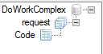

Figure A."DoWorkComplex" method, "Code" input parameter

4. **Auto Map button** If there is a mapping in which one or several of the
WCF parameters are named exactly as the XRM variable we want to map to, the
button will map those automatically.

5. **Data Conversion section** Explained in detail in the section *Response
Mappings Info*.

6. **Ok / Cancel section** After pressing **OK** the changes will be saved
and the input parameters will be mapped. **Cancel** to discard.

After *OK* is pressed, the next section to configure will be the *Response*,
in order to store the Service Results in our process as desired.

### Response Mappings Info

The response given by the Service can be mapped in two ways:

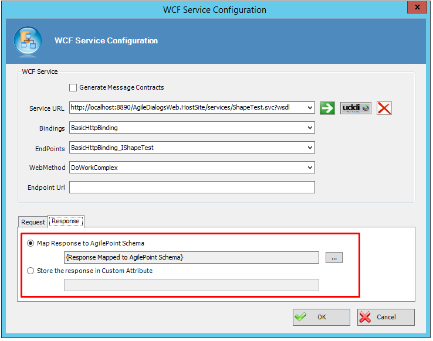

-   Map Response to AgilePoint Schema. The WCF results will be stored in the
    process schema, and the XRM process variables could be used to be mapped
    against the mentioned results.

-   Store the response in Custom attribute. Map straightaway to a custom
    attribute defined inside our process.

If it is needed to save the results into AgilePoint schema, we should map the
results to the desired output variables. To do so, click on the ellipsis button.
This window will come up:

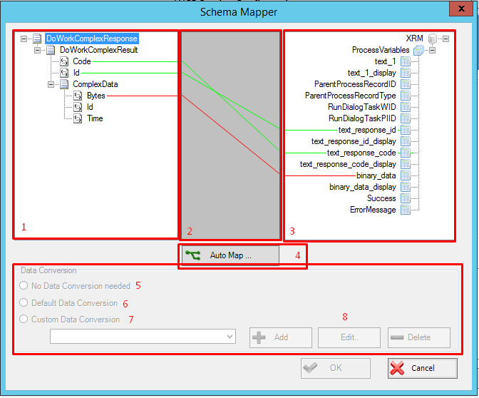

Explained in sections:

1. **WCF Service response results** This section holds the WCF methods with
its variables that are supposed to return all inner values we need to map. As it
is shown, the data results could be simple types (Code, ID) or Complex Data
(ComplexData variable), which we can map as well to our context variables.

2. **Mapping Area** Same mechanism as the one explained in the mapping area
of *Request Mapping* section, with one important point to discuss. In the
example shown below, there is a mapping (the one represented as a red arrow)
that tells us that the two mapped variables (bytes and binary_data) are not
correctly linked and there is a problem of any kind.

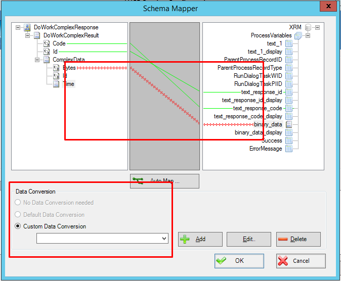

> 'Bytes' and 'binary_data' do not have the same data type. A data
conversion is required to continue.

There is a data-type problem, and the *Custom Data Conversion* has been selected
by default. This tells us that we should create a conversion procedure for this
mapping to succeed in the runtime execution of the process (explained in detail
later on).

3. **XRM Results Area** Variables to hold the desired WCF values to save.
Please note the difference with the results area from the *request mapping info*
as the schema mapper only allows us to store values in the process variables
from XRM.

4. **Auto Map button** Same mechanism as the explained in the same point in
*Request mapping info*.

5. **No data conversion needed** After choosing a mapping, if there is no
data type issues between the two variables, this would be the default value.

6. **Default Data Conversion** Default data conversion applied to certain
types.

7. **Custom Data Conversion** Applied to the current example: The current
mapping (bytes-\>binary_data variables) do not have the same data type. This
means that we will have to create a custom data conversion. To do such task, it
is necessary to:

- Click on the **Add** button. A *Custom mapping mode* dialog will be shown.

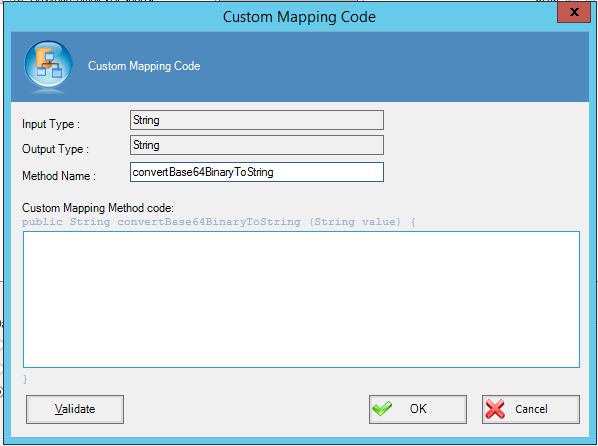

In the Dialog, we can see that has been detected that the WCF return value
(bytes) is binary data-type and the XRM process value (data-variables) is
string. A custom inner method has been automatically inferred to correct this
issue (method that converts binary to string, detailed in *Custom Mapping Method
code*). It is needed to complete this task by specifying the exact operation we
want to do with the returning value; in this case, the conversion has been
applied and it is only required to return the value

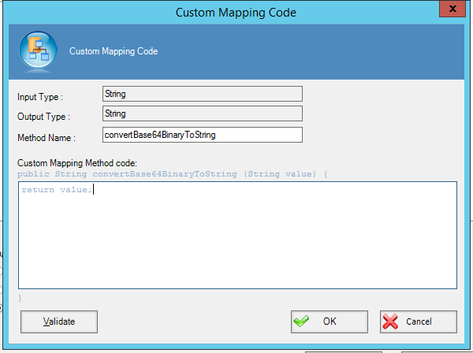

Lastly, by pressing **Validate**, we check that the syntax is correct.

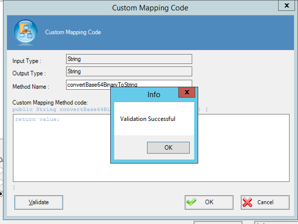

After returning to the main dialog, please notice that the new *custom*
conversion is being applied to this mapping, so we can finally accept the
changes by pressing **OK** and save the model.

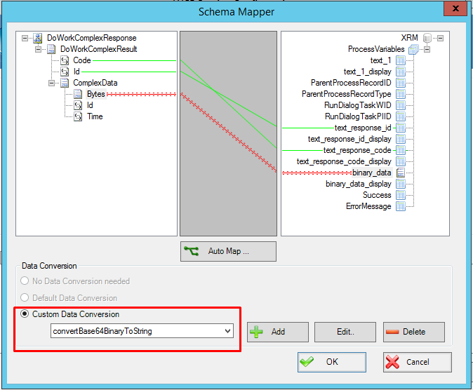

## Shape-Specific Properties

| Property | Description |
| -------- | ----------- |
| __Configure__ | Opens configuration window |

## Other Common Properties
All shapes have many other common properties. Look them up here: [Common Poperties](common/README.md)

## Actions
See [Actions](common/Actions.md)

