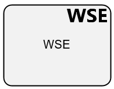

**[Home](/) --> [Reference](../ref) --> Web Service Enhancements**

# Web Service Enhancements 

An AgilePart activity that accesses a Web Service and its methods which are registered in AgilePoint Envision. 
The user can select the appropriate Web Service and its specific method using the Web Service shape. 
The Web Service Extension uses SOAP calls over HTTP and allows for schema mapping between the AgilePoint application schema and the Web method's request schema.

> **Note**: This activity is available under *Web Services*

## Shape-Specific Properties

| Property | Description |
| -------- | ----------- |
| **NeedCallback** | This property determines whether this AgileShape is exited immediately after invoking the Web service method, or will wait to exit until the activity's status is explicitly updated to Complete. This property can be set to the following specific values: **False** - This value indicates that the AgileShape invoke its associated .NET method synchronously. The AgileShape will be exited (at runtime) immediately after invoking the Web service method. **True** - This value indicates that the AgileShape invoke its associated .NET method asynchronously (i.e. in a separate thread). The AgileShape will be exited (at runtime) only after the activity's status is explicitly updated. This explicit update could be performed manually (e.g. using AgilePoint Enterprise Manager) or automatically by an external system (e.g. by a separate application that uses the AgilePoint Workflow API to programmatically update the activity's status). Default value: False|
|**Configuration**|Opens the [Web Service Enhancements  Configuration](common/WebServiceEnhancementsConfiguration.md) window, where you can configure which Web service method should be invoked at runtime. It also allows the process modeler to configure the custom process attributes that should be associated with the Web service method's parameters (if any), and the custom process attribute that will be used to store the Web service method's return value (if any).|
|**Credential**|[Credential property](common/credentials.md)|
|**Proxy**|[Proxy property](common/proxy.md)|
|**Timeout**|Specifies the maximum amount of time (in seconds) that should be allowed for the completion of the web service call for this AgileShape. Default value: 600|

## Other Common Proporties
All shapes have many other common properties. Look them up here: [Common Poperties](common/README.md)

## Actions
See [Actions](common/Actions.md)
