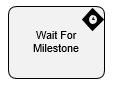

**[Home](/) --> [Reference](../ref) --> ShapeNameDisplay**

# Wait For Milestone

An activity that, when used together with the [Pass Milestone](PassMilestone.md), lets a process wait for an event that is not in the process, and then continue once the event is complete.

For example, if an activity can not start until an approval occurs in a subprocess, you can use this activity to control the process based on that event.. The Pass Milestone and Wait for Milestone activities work together in a caller/listener model to support this functionality.

> __NOTE__: This activity is available under  *Advanced Extension*.

## Shape-Specific Properties

| Property | Description |
| -------- | ----------- |
| __Configuration__ | Opens the  [Wait For Milestone Configuration](common/WaitForMilestoneConfiguration.md) dialog box. |
| __Number__ | Number of milestone to be passed for complete the activity. |

## Other Common Properties
All shapes have many other common properties. Look them up here: [Common Poperties](common/README.md)

## Actions
See [Actions](common/Actions.md)

## Disclaimer of warranty

[Disclaimer of warranty](../guides/common/DisclaimerOfWarranty.md)