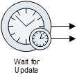

__[Home](/) --> [Reference](/ref) --> Wait For Update__

# Wait For Update

This activity is used to wait until a condition is met in CRM. This can be used
in many scenarios. For example:

-   Make all order items processes to wait until customer account credit rating
    becomes High.

-   Make a process wait until product stock is sufficient to fulfill an order

The process will wait until the condition configured in the query is met.

It is common to **Add a Timer** to this shape in order not to wait indefinitely.
This way when the due date is reached, the process will continue using the
alternative route:

## Shape-Specific Properties

| Property | Description |
| -------- | ----------- |
| **EntityID**        | [Entity ID](common/EntityID.md)|
| **EntityName**      |[Entity Name](common/EntityName.md)|
| **QueryExpression** |[Query Expression](common/QueryExpression.md)|

## Other Common Properties
All shapes have many other common properties. Look them up here: [Common Poperties](common/README.md)

## Actions
See [Actions](common/Actions.md)

## Disclaimer of warranty

[Disclaimer of warranty](../guides/common/DisclaimerOfWarranty.md)