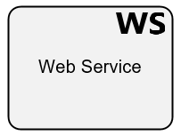
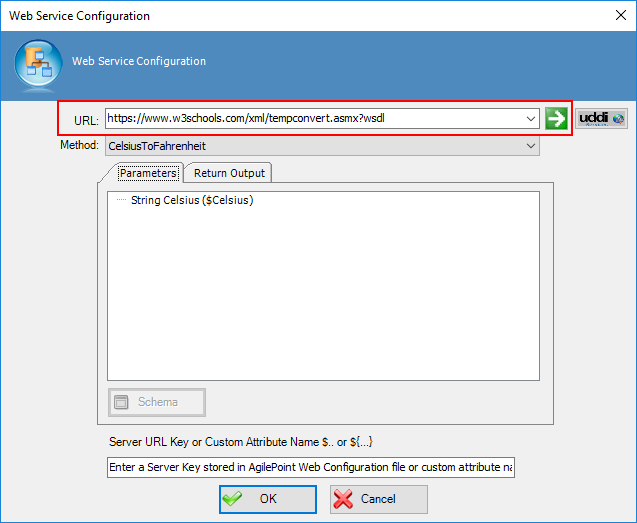
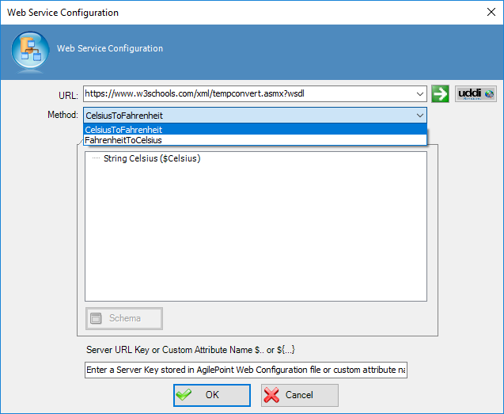
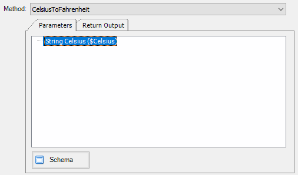
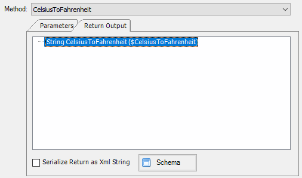

__[Home](/) --> [Reference](/ref) --> Web Service__

# Web Service

This shape creates a Web Service Activity, which allows consuming a SOPA ASMX Web Service to retrieve extrernal data or send data externally.

> **Note**: In order to use this shape, the web service must have WSDL description enabled.

> **Note**: This activity is available under *Web Services*
 
## Configure

Press `Elipsis button`  from **Configure** property, in order to open Configuration window.

In order to configure, type URL service addess and press `Get service metadata button`.

By this action service metadata is received and *Method* dropdown list is filled with service methods. Now, choose the method to invoke it.

Once service method is selected, lists under *Paremeters* and *Return output* tabs are filled with service  arguments input and output values. Choose each parameter to assign value from AgilePoint schema.

Perform same operation to assign service return values to AgilePoint schema variable.

When designtime and runtime bla...bla...
**Server URL key**

## Shape-Specific Properties

| Property | Description |
| -------- | ----------- |
| **Configure** | Opens configuration window.|
| **Credential** | [Credential](common/credentials.md) |
| **Proxy** | [Proxy](common/proxy.md) |
| **Timeout** | Timeout to invoke web service method. |

## Other Common Properties
All shapes have many other common properties. Look them up here: [Common Poperties](common/README.md)

## Actions
See [Actions](common/Actions.md)
