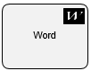

__[Home](/) --> [Reference](/ref) --> Word__

# Word

An AgilePart that creates Word documents (.doc or .docx files) or PDF files from Word templates (.dot or .dotx files), populating Mail Merge or bookmark fields in the template with values you specify in the generated document.

> __NOTE__: For information about creating a Word template, see the online help for Microsoft Word regarding Word templates, Mail Merge fields, and bookmark fields.

<!--
Please refer to the AgilePoint documentation to know about this shape (<http://documentation.agilepoint.com/SupportPortal/DOCS/ProductDocumentation/05.02.0100/DocumentationLibrary/maps/index.html#agileshapeWord.html>)
-->
## Shape-Specific Properties

| Property | Description |
| -------- | ----------- |
| __Configuration__ | [Create word configuration](common/WordConfigurationProperty.md) |

## Other Common Properties
All shapes have many other common properties. Look them up here: [Common Poperties](common/README.md)

## Actions
See [Actions](common/Actions.md)

