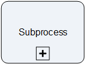

__[Home](/) --> [Reference](/ref) --> XRM SubProcess__

# XRM SubProcess

When entered, this AgileShape will initiate another AgileXRM process instance as
a sub-process.

This functionality is useful for breaking complex processes to more manageable
chunks and also allows creating more modular processes, and enhances
reusability.

It allows selecting any Proceess of type *AgileXRM*. For initiating other types
of processes, use the **[SubProcess](SubProcess.md)** shape in the Generic stencil.

This shape does NOT share the context of the caller with the child, assuming
that the Main Entity of the child is different. If the Main Entity of the child 
process is the same as the calling parent process, then set the *Share Attibutes* property yo *True*.

However, if Main Entity for child process is different, then to pass individual
variables to the child process use the *SubProcessParams* property.

When selecting a sub-process, it is possible to initiate the latest version or a
particular version. Please see below for details of choosing which version of
the sub-process template to initiate.

## Configuration Dialogs

### Process Selector Dialog

See the *Sub Process* property.

### SubProcess Parameters Dialog

See the *SubProcessParams* property.

## Shape-Specific Properties

| Property | Description |
| -------- | ----------- |
| **NamePrefix**              | [Name Prefix](common/NamePrefix.md)              |
| **RunProcessIndependently** | [Run Process Independently](common/RunProcessIndependently.md) |
| **SaveProcessInstanceIdTo** | [Save Process Instance Id To](common/SaveProcessInstanceIdTo.md) |
| **ShareAttributes**         | [Share Attributes](common/ShareAttributes.md)         |
| **Sub Process**             | [SubProcess](common/SubProcess.md)             |
| **SubProcessInitiator**     | [SubProcess Initiator](common/SubProcessInitiator.md)     |
| **SubProcessParams**        | [SubProcess Params](common/SubProcessParams.md)        |
| **Wait**                    | [Wait](common/Wait.md)                    |

## Other Common Properties
All shapes have many other common properties. Look them up here: [Common Poperties](common/README.md)

## Actions
See [Actions](common/Actions.md)

## Disclaimer of warranty

[Disclaimer of warranty](../guides/common/DisclaimerOfWarranty.md)