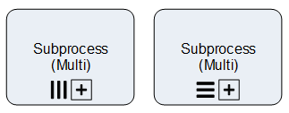

__[Home](/) --> [Reference](/ref) --> XRM SubProcess Multi__

# XRM SubProcess Multi

This shape is used to start one sub-process for each record in a list. The list
can be the result of a query using the *QueryExpression* parameter or passed as
a semicolon-separated llist of IDs in the *EntityIds* parameter (in conjunction
with *EntityName*).

If the *Wait* parameter is set to *True*, the process continues once all the
subprocesses that were initiated by this shape are completed.

SubProcesses can be initiated sequentially or in parallel.

Typically this is used to manage the lifecycle of child entities, for example
Order Line Items of an Order.

## Configuration Dialogs

### Process Selector Dialog

See the *Sub Process* property.

### SubProcess Parameters Dialog

See the *SubProcessParams* property.

## Shape-Specific Properties

| Property | Description |
| -------- | ----------- |
| **EntityIds**               | [Entity Ids](common/EntityIds.md)               |
| **EntityName**              | [Entity Name](common/EntityName.md)              |
| **ExecutionMode**           | Default value: **Parallel** - **Parallel** : All subprocesses are started in parallel in no particular order - **Sequential** : subprocesses are initiated one by one so next subprocess is not started until previous subprocess is completed (or cancelled)|
| **NamePrefix**              | [Name Prefix](common/NamePrefix.md)              |
| **QueryExpression**         | [Query Expression](common/QueryExpression.md)         |
| **RunProcessIndependently** | [Run Process Independently](common/RunProcessIndependently.md) |
| **SaveProcessInstanceIdTo** | [Save Process Instance Id To](common/SaveProcessInstanceIdTo.md) |
| **Sub Process**             | [SubProcess](common/SubProcess.md)             |
| **SubProcessInitiator**     | [SubProcess Initiator](common/SubProcessInitiator.md)     |
| **SubProcessParams**        | [SubProcess Params](common/SubProcessParams.md)        |
| **TargetVariableName**      | Optional This property allows every child process instance to receive the ID of the entity against which the subprocess is executed, in a variable inside the child process (default: *CrmBeId*) |
| **Wait**                    | [Wait](common/Wait.md)                    |

## Other Common Properties
All shapes have many other common properties. Look them up here: [Common Poperties](common/README.md)

## Actions
See [Actions](common/Actions.md)

## Disclaimer of warranty

[Disclaimer of warranty](../guides/common/DisclaimerOfWarranty.md)