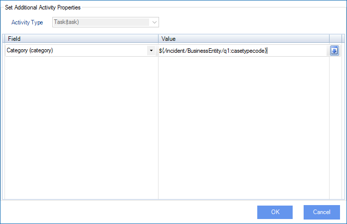

__[Home](/) --> [Reference](/ref) -->  [Parent Shape](javascript:history.back()) --> Activity Properties__

### ActivityProperties property 

**Optional**

Click the ellipsis button to open the configuration dialog which can be used to
update any activity fields including custom fields:

| **Field Name / Button** | **Definition**                                                                 |
|-------------------------|--------------------------------------------------------------------------------|
| **Activity Type**       | Shows all the activity types including custom activity types                   |
| **Field**               | Select the field for the selected Activity Type                                |
| **Value**               | Sets the value of the Field. Type **\${** to open the [Schema Selector](SchemaSelector.md) window to enter a dynamic value |
| **Down Arrow**          | Add new Field-Value pair or Remove existing Field-Value pair                   |

## Disclaimer of warranty

[Disclaimer of warranty](../../guides/common/DisclaimerOfWarranty.md)